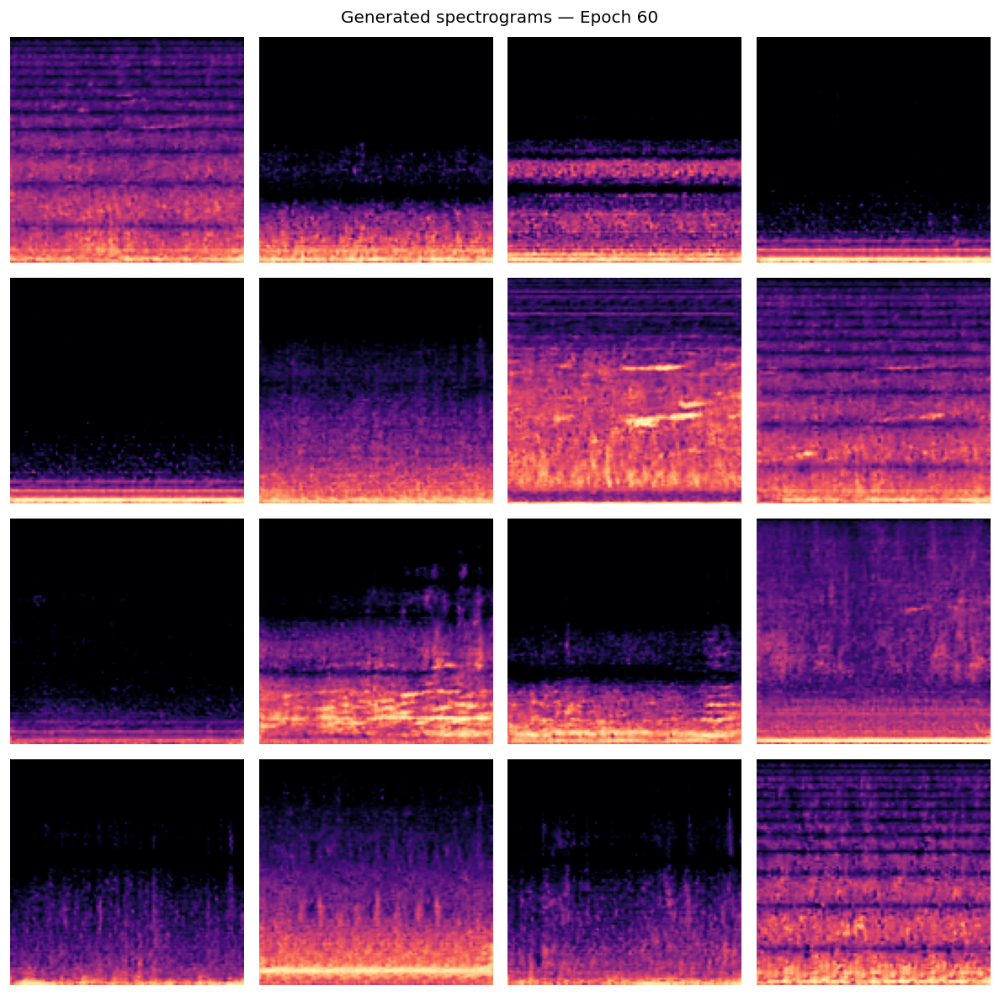
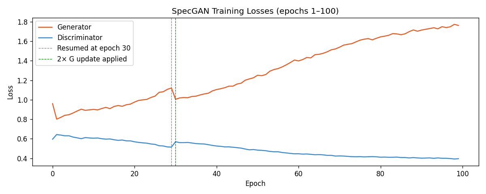

# OrcaCallGAN: Spectrogram-Based GANs for Orca Call Synthesis

A SpecGAN-based deep learning framework for generating realistic orca vocalization spectrograms from bioacoustic recordings.

---

## Project Overview

This project explores the application of Generative Adversarial Networks (GANs) to bioacoustic signal synthesis. The model learns temporal and spectral characteristics of real orca vocalizations and generates realistic spectrograms from latent vectors.

The complete pipeline includes:

- Audio preprocessing
- Noise reduction
- Spectrogram generation
- Data normalization
- Data augmentation
- SpecGAN training
- Spectrogram synthesis
- Audio reconstruction

---

## Sample Outputs

<p align="center">
  
</p>

---

## Performance Metrics

| Metric | Value |
|-------|--------|
| Dataset Size | 732 audio samples |
| Architecture | SpecGAN |
| Framework | PyTorch |
| FID Score | 46.3 |
| Device | Apple Silicon MPS |
| Audio Domain | Orca Vocalizations |

---

## Pipeline

```text
Raw Audio Recordings
          ↓
Noise Reduction
          ↓
Mel Spectrogram Generation
          ↓
Normalization
          ↓
Data Augmentation
          ↓
SpecGAN Training
          ↓
Generated Spectrograms
          ↓
Audio Reconstruction
```

---

## Dataset

The dataset consists of 732 orca vocalization recordings collected from publicly available marine bioacoustic datasets.

### Preprocessing Steps

- Noise reduction
- Equalization filtering
- Mel spectrogram generation
- Normalization
- Data augmentation

---

## Model Architecture

```text
Latent Noise Vector
          ↓
      Generator
          ↓
Generated Spectrogram
          ↓
    Discriminator
          ↓
Real / Fake Classification
```

---

## Repository Structure

```text
├── Preprocessing/
├── Results/
├── generated_audio/
├── dataset.py
├── model.py
├── losses.py
├── train.py
├── invert.py
├── denoise.py
├── SampleGenerate.py
├── SampleView.py
└── requirements.txt
```

---

## Training Results

### Generator and Discriminator Loss

<p align="center">
  
</p>

### Training Progress

<p align="center">
  
</p>

---

## Spectrogram Comparison

### Real Spectrograms

<p align="center">
  
</p>

### Generated Spectrograms

<p align="center">
  
</p>

---

## Generated Audio Samples

Generated audio files are available in the `generated_audio` directory.

Examples:

- generated_clean_denoised.wav
- generated_clean_denoised_eq.wav

---

## Installation

```bash
git clone https://github.com/7mgppp/Spectrogram-Based-GANs-for-Orca-Call-Synthesis-I.git

cd Spectrogram-Based-GANs-for-Orca-Call-Synthesis-I

pip install -r requirements.txt
```

---

## Training

```bash
python train.py
```

---

## Generate Samples

```bash
python SampleGenerate.py
```

---

## View Generated Samples

```bash
python SampleView.py
```

---

## Technologies Used

- Python
- PyTorch
- NumPy
- Librosa
- Matplotlib
- Scikit-learn

---

## Results Summary

- Learned temporal and harmonic structures of orca calls.
- Generated realistic spectrogram representations.
- Achieved an FID score of 46.3.
- Successfully reconstructed synthesized audio samples.

---

## Future Work

- Improve FID scores.
- Train on larger bioacoustic datasets.
- Explore diffusion-based audio generation.
- Improve waveform reconstruction quality.
- Investigate conditional audio generation.

---

## Applications

- Marine bioacoustics research
- Wildlife conservation
- Acoustic data augmentation
- Animal communication studies
- Generative audio modeling

---

## Author

**Miilee Sharma**

B.Tech Computer Science (Data Science)  
Manipal University Jaipur

GitHub: https://github.com/7mgppp

---

## License

This project is released under the MIT License.
